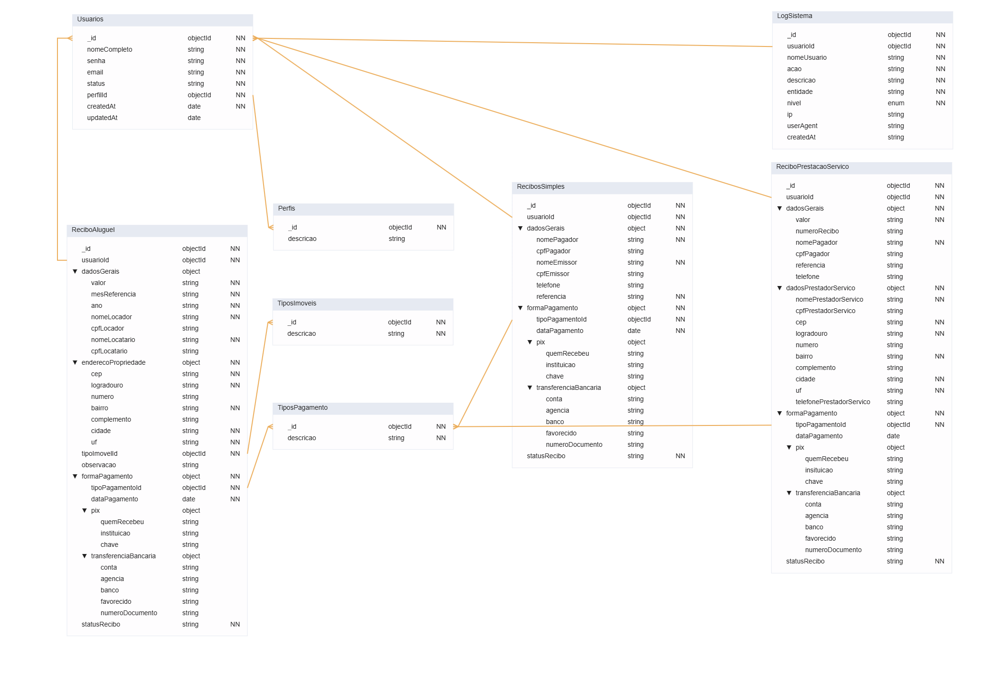
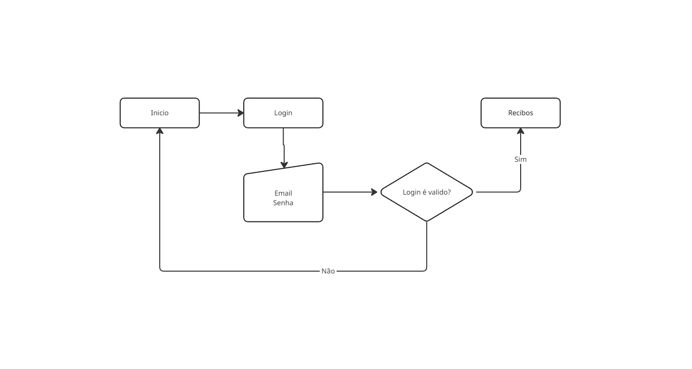
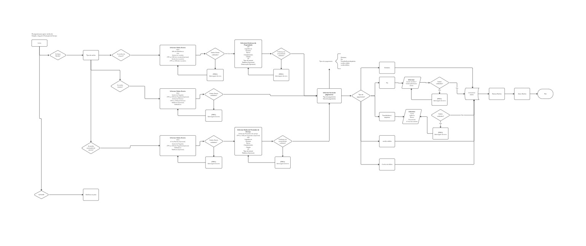
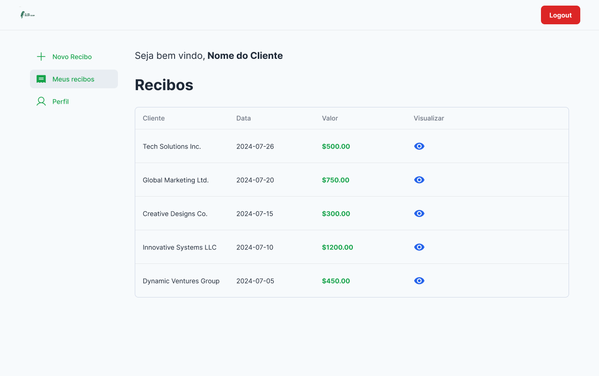
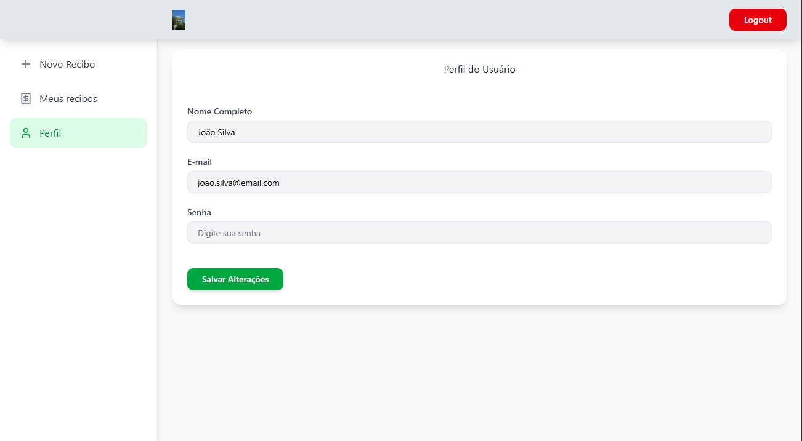
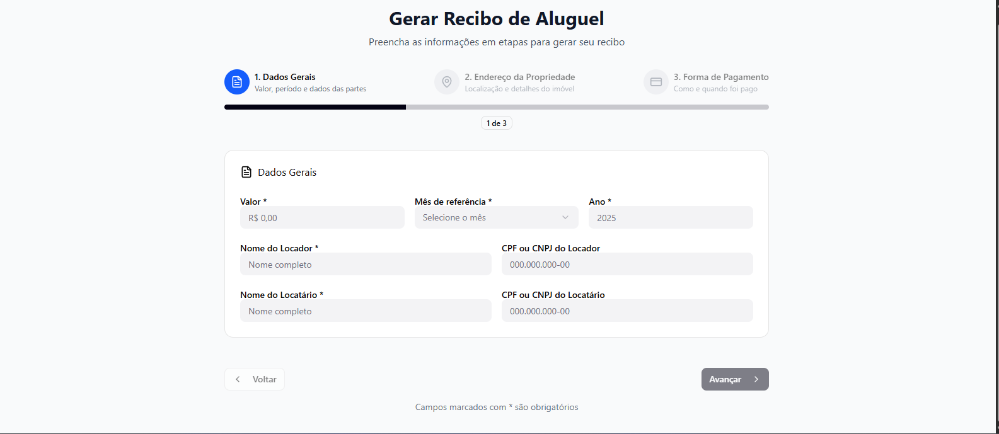
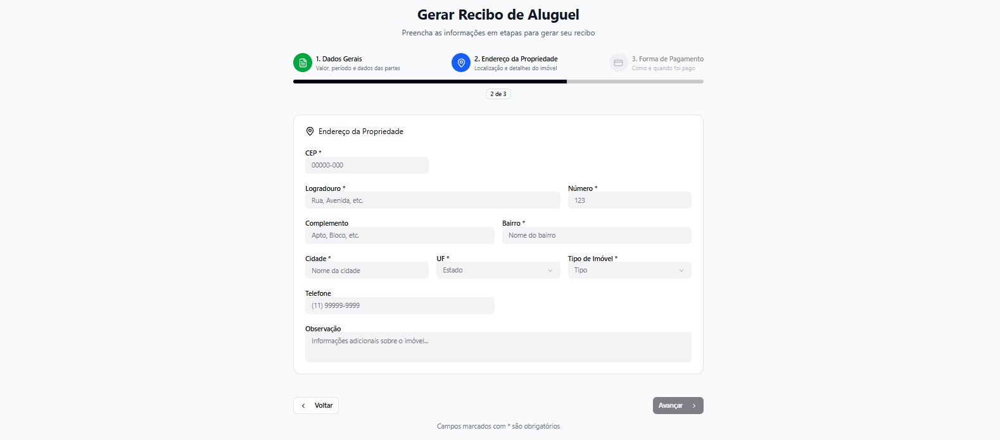
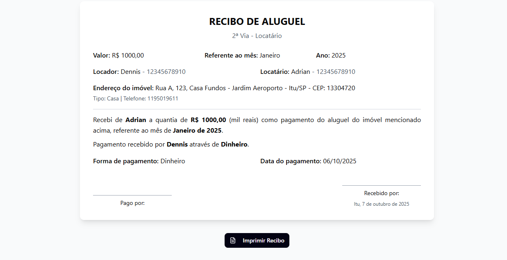

# Emissor de Recibo Online

1. ### Visão Geral
   
   Aplicação para criação e emissão de diversos tipos de recibos (`aluguel`, `prestação de serviço ` e `simples`), com geração de PDF e histórico por usuário.

  Stacks
   -  **Frontend:** `Angular` + `Angular Material`
   -  **Backend:** `NestJS`
   -  **Banco de dados:** `MongoDB (Atlas) com Mongoose`
   -  **Validação DTOs:** `Zod`
   -  **Autenticação:** `JWT + bcrypt`
   -  **Deploy frontend:** `Vercel`
   -  **Deploy backend:** `Render`
   -  **Logs:** coleção `LogSistema` no MongoDB

2. ### Requisitos (resumido) 
  Funcionais
  - Autenticação (login / refresh token)
  - CRUD de recibos (vários tipos)
  - Gerar PDF do recibo
  - Histórico do usuário (listar recibos)
  
  Não funcionais
  - API Restfull com documentação (`Swagger`)
  - Validação e sanitização de entradas (`Zod`)
  - Auditoria básica em LogSistema
  - Escalabilidade horizontal do backend

3. ### Arquitetura (resumido)

  ```mermaid
flowchart LR
    subgraph Frontend
      A[Angular App]
    end

    subgraph Infra
      C[NestJS API]
      D[MongoDB Atlas]
    end

    A -->|HTTPS| C
    C -->|mongoose| D
    C -->|logs| L[LogSistema collection in MongoDB]

    subgraph Auth
      F[JWT Service]
    end

  C --> F
```

  Componentes principais
  - `Frontend (Anugular)`: Guarda rotas, services HTTP, interceptors (token).
  - `API (NestJS)`: Controllers, services, repositories, schemas, Dtos (Zod).
  - `DB (Mongo Atlas)`: coleções `Usuarios`, `Perfis`, `Recibos`, `Tipos`, `LogSistema` 


4. ### Estrutura
```
.
└── src/
    ├── main.ts
    ├── app.module.ts
    ├── common/
    │   ├── filters/
    │   ├── repositories/
    │   ├── interceptors/
    │   ├── guards/
    │   ├── pipes/
    │   └── utils/
    ├── modules/
    │   ├── auth/
    │   │   ├── auth.module.ts
    │   │   ├── auth.controller.ts
    │   │   ├── auth.service.ts
    │   │   └── strategies/
    │   ├── users/
    │   │   ├── users.module.ts
    │   │   ├── users.controller.ts
    │   │   ├── users.service.ts
    │   │   ├── users.repository.ts
    │   │   └── schemas/user.schema.ts
    │   ├── recibos/
    │   │   ├── recibos.module.ts
    │   │   ├── controllers/
    │   │   │   └── recibo.controller.ts
    │   │   ├── services/
    │   │   │   └── recibo.service.ts
    │   │   ├── repositories/
    │   │   │   └── recibo.repository.ts
    │   │   └── schemas/
    │   │       ├── recibo-aluguel.schema.ts
    │   │       ├── recibo-prestacao.schema.ts
    │   │       └── recibo-simples.schema.ts
    │   ├── tipos/
    │   │   ├── tipos.module.ts
    │   │   └── tipos.service.ts
    │   └── logs/
    │       ├── logs.module.ts
    │       ├── logs.service.ts
    │       └── logs.repository.ts
    └── config/
        └── configurations (env)
```

**Padrão:** Controller → Service → Repository → Mongoose Model. 
Respositories encapsulam queries ao MongoDB.

5. ### Coleções




`Usuarios`: 
  _id, nomeCompleto, senha, email, status, perfilId, createdAt, updatedAt

`Perfis`: _id, descrição

`ReciboAluguel`: _id, usuarioId, dadosGerais { valor, mesReferencia, ano, nomeLocador, cpfLocador, nomeLocatario, cpfLocatario }, enderecoPropriedade { cep, logradouro, numero, bairro, complemento, cidade, uf }, tipoImovelId,observacao, forma pagamento { tipoPagamentoId, dataPagamento }

`ReciboSimples`: dadosGerais { nomePagador, cpfPagador, nomeEmissor, cpfEmissor, telefone, referencia }, formaPagamento { tipoPagamentoId, dataPagamento }

`ReciboPrestacaoServico`: _id, dadosGerais { valor, numeroRecibo, nomePagador, cpfPagador, referencia, telefone }, dadosPrestadorServico { nomePrestadorServico, cpfPrestadorServico, cep, logradouro, numero, bairro, complemento, cidade, uf, telefonePrestacaoServico }, formaPagamento { tipoPagamentoId, dataPagamento }

`TiposImoveis`: _id, descricao

`TiposPagamentos`: _id, descricao

`LogSistema`: _id, usuarioId, nomeUsuario, acao, descricao, entidade, ip, useAgent, createdAt


6. ### Autenticação e segurança
Fluxo
  - `POST/auth/login` → valida crendenciais → emite ` { accessToken, refreshToken }`
  - `POST/auth/refreshToken` → renova accessToken (usando stored refreshToken)
  - Routes protegidas por `AuthGuard` (JWT)
  - Passwords: `bcrypt.hash` (salt >= 10)

Recomendações de segurança
  - Armazenar `JWT_SECRET` em env vars seguras
  - Limitar tempo do accessToken e usar refreshToken de 1 em 1 dia
  - Implementar rate limiting e proteção contra brute-force no endpoint `/auth/login`
  - Validar e sanitizar todas entradas (`Zod`)
  - Habilitar HTTPS/secure headers no deploy

7. ### Logs e Auditoria
  - Middleware/interceptor registra operações importantes em `LogSistema`.
  - Estrutura do log:
      ```json
      {
        "usuarioId": "...",
        "nomeUsuario": "Fulano",
        "acao": "CREATE_RECIBO",
        "descricao": "Criou recibo de aluguel referencia 2025-09",
        "entidade": "ReciboAluguel",
        "ip": "x.x.x.x",
        "userAgent": "...",
        "createdAt": "..."
      }

      ```  

8. ### Endpoints

Auth
  - `POST /auth/login` — body { email, senha }
  - `POST /auth/refreshToken`— body { refreshToken }
  
Usuarios
  - `GET /usuario/usuarioId={id}` — recuperar um usuário
  - `PUT /usuario/usuarioId={id}` — atualizar um usuário
  - `POST /usuario` — inserir novo usuário
  - `DELETE /usuario/usuarioId={id}` — excluir um usuário
  
Recibos
  - `GET /recibos` — listar todos os recibos
  - `GET /recibo/reciboId={id}` — obter um recibo
  - `PATCH /recibo/reciboId={id}` — atualizar alguns campos do usuário
  - `DELETE /recibo/reciboId={id}` — excluir um recibo

Logs
  - `GET /logs` (admin) — recuperar todos os logs

9. ### Fluxograma

Login



Sistema



10. ### Deploy

  - **Frontend**: Vercel (deploy automático a partir do Github)
  - **Backend**: Render através de container docker
  - **Banco de dados**: MongoDb Atlas (cluster free tier)
  - **Env**: dotenv para desenvolvimento
  - **CI/CD**: Github Actions — rodar deploy automático

11. Layout

#### Login


#### Dashboard


### Formulário recibo de aluguel


#### Formulário recibo de prestação de serviço


#### Fomulário de recibo simples


#### Pefil do usuário


#### Gerar recibo de aluguel

  Etapa 1
  

  Etapa 2
  

  Etapa 3 
  

  Resumo do recibo
  

---
📄 **Autor:** Dennis José de Carvalho  
🕒 Última atualização: Outubro/2025

